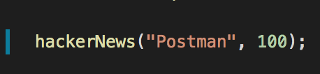
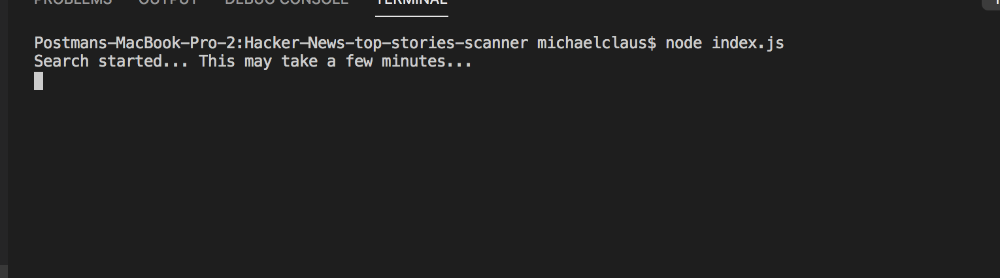
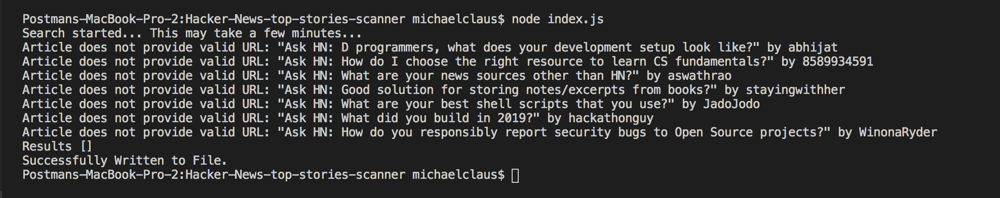
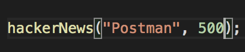
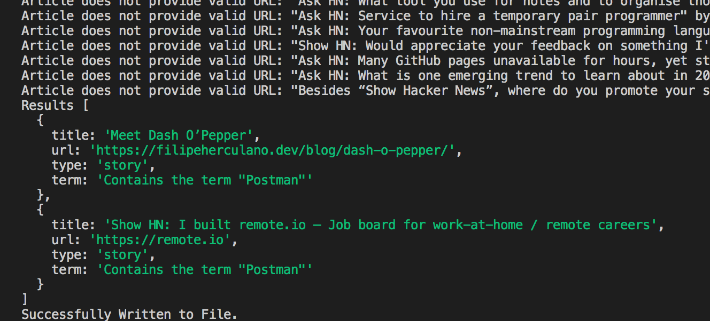
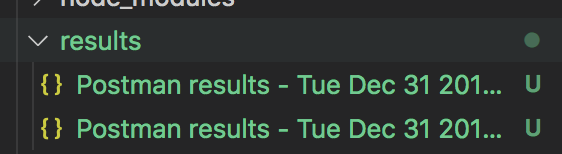
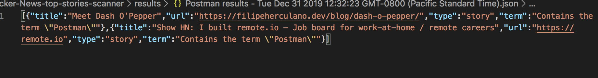
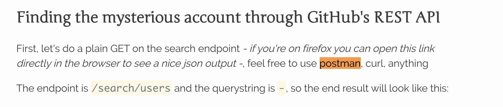
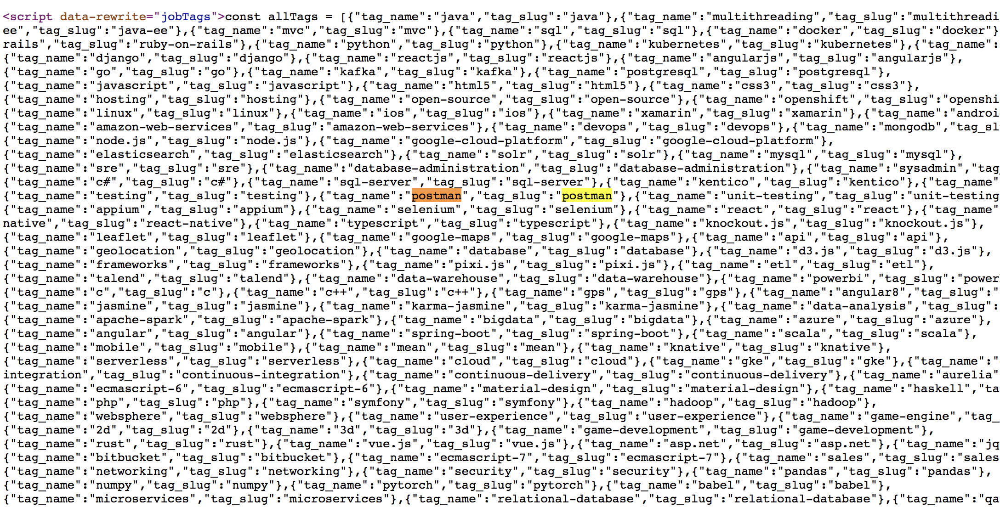

# Hacker News Scanner

## By Michael Claus

### www.michaelclaus.io

mclausaudio@gmail.com | mclausaudio@gmail.com | linkedin.com/in/mclausaudio/

This script will scan through a provided number of Hacker News' top articles and return any article that contains a designated term.

This is useful if you'd like to see if a particular company, technology or person is being talked about in Hacker News and don't want to read through every article manually.

### How to Use

Clone down the repo and run `npm i`

At the top of index.js on line 4, invoke the hackerNews function. The first argument is the term, the second is the number of top articles you'd like to search through. So, if you'd like to search through the top 100 hacker news articles to see if they include the term "Postman", you'd do the following:

The script will begin to run and your terminal will display the following message:

The searching process may take a few minutes depending on how many articles you are searching through.  If a Hacker News post does not include a link to an external article or page, for example a community question or discussion thread, a message will be displayed in the terminal.  The results will be logged to the terminal.  Below shows what a search with NO RESULTS will look like.

Lets increase the number of articles to search through up to 500

This script will take a few minutes to complete and will return the results.  This time, we had some results.

Results will also be written to a `.json` file and placed into the 'results' folder

Now we can visit the page and hit CMD+F to find the term.  Here's a screenshot of the section from one of the returned results.

**An important note:** This script scans through the entire pages source code which means the term may be included somewhere other than the page's text/content.  Here is an example of a result that did not visibily contain the term "Postman"

Using a CMD+F search for the term did not produce any results, however searching through the pages sources code did.  As you can see, the term is not being used in the page's content but is being used for SEO purposes.

---

Improvements to make:
- Automate script to run daily.
- Detailed error handling.
- Include URL to specific Hacker News post in addition to external link.
- Create an option to scan through text inside the articles `<body></body>` tag only.
- Scan through each posting's comments in addition to the provided link.
- If the posting is NOT an article, scan through the comments section instead.
- Back end to make script executable via an API.
- Make results accessible to other team members / developers via an API.
- Auth (users / teams)

---

Please let me know if you have feedback or a feature idea.  If you see a bug or issue, feel free to contribute.  My email is mclausaudio@gmail.com.

Shout out to Ryan McBride (@Ryan-McBride) for the initial idea.